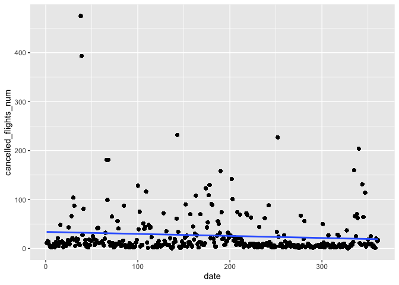

stat 433 HW1
================

``` r
library(dplyr)
```

    ## 
    ## Attaching package: 'dplyr'

    ## The following objects are masked from 'package:stats':
    ## 
    ##     filter, lag

    ## The following objects are masked from 'package:base':
    ## 
    ##     intersect, setdiff, setequal, union

``` r
library(nycflights13)
flights
```

    ## # A tibble: 336,776 × 19
    ##     year month   day dep_time sched_dep_time dep_delay arr_time sched_arr_time
    ##    <int> <int> <int>    <int>          <int>     <dbl>    <int>          <int>
    ##  1  2013     1     1      517            515         2      830            819
    ##  2  2013     1     1      533            529         4      850            830
    ##  3  2013     1     1      542            540         2      923            850
    ##  4  2013     1     1      544            545        -1     1004           1022
    ##  5  2013     1     1      554            600        -6      812            837
    ##  6  2013     1     1      554            558        -4      740            728
    ##  7  2013     1     1      555            600        -5      913            854
    ##  8  2013     1     1      557            600        -3      709            723
    ##  9  2013     1     1      557            600        -3      838            846
    ## 10  2013     1     1      558            600        -2      753            745
    ## # … with 336,766 more rows, and 11 more variables: arr_delay <dbl>,
    ## #   carrier <chr>, flight <int>, tailnum <chr>, origin <chr>, dest <chr>,
    ## #   air_time <dbl>, distance <dbl>, hour <dbl>, minute <dbl>, time_hour <dttm>

``` r
library(ggplot2)
```

HW 1. How many flights have a missing dep\_time? What other variables
are missing? What might these rows represent?

``` r
sum(is.na(flights$dep_time))
```

    ## [1] 8255

``` r
filter(flights,is.na(flights$dep_time))
```

    ## # A tibble: 8,255 × 19
    ##     year month   day dep_time sched_dep_time dep_delay arr_time sched_arr_time
    ##    <int> <int> <int>    <int>          <int>     <dbl>    <int>          <int>
    ##  1  2013     1     1       NA           1630        NA       NA           1815
    ##  2  2013     1     1       NA           1935        NA       NA           2240
    ##  3  2013     1     1       NA           1500        NA       NA           1825
    ##  4  2013     1     1       NA            600        NA       NA            901
    ##  5  2013     1     2       NA           1540        NA       NA           1747
    ##  6  2013     1     2       NA           1620        NA       NA           1746
    ##  7  2013     1     2       NA           1355        NA       NA           1459
    ##  8  2013     1     2       NA           1420        NA       NA           1644
    ##  9  2013     1     2       NA           1321        NA       NA           1536
    ## 10  2013     1     2       NA           1545        NA       NA           1910
    ## # … with 8,245 more rows, and 11 more variables: arr_delay <dbl>,
    ## #   carrier <chr>, flight <int>, tailnum <chr>, origin <chr>, dest <chr>,
    ## #   air_time <dbl>, distance <dbl>, hour <dbl>, minute <dbl>, time_hour <dttm>

8255 fights have a missing dep\_time. At the same time, dep\_delay,
arr\_time, arr\_delay, and air\_time are missing. These rows represent
that these flights might be cancelled.

1.  Currently dep\_time and sched\_dep\_time are convenient to look at,
    but hard to compute with because they’re not really continuous
    numbers. Convert them to a more convenient representation of number
    of minutes since midnight.

``` r
flights <- mutate(flights,
                  dep_mins_since_midnight = dep_time %/% 100 * 60 + dep_time %% 100,
                  sched_dep_mins_since_midnight = sched_dep_time %/% 100 * 60 + sched_dep_time %% 100)
flights
```

    ## # A tibble: 336,776 × 21
    ##     year month   day dep_time sched_dep_time dep_delay arr_time sched_arr_time
    ##    <int> <int> <int>    <int>          <int>     <dbl>    <int>          <int>
    ##  1  2013     1     1      517            515         2      830            819
    ##  2  2013     1     1      533            529         4      850            830
    ##  3  2013     1     1      542            540         2      923            850
    ##  4  2013     1     1      544            545        -1     1004           1022
    ##  5  2013     1     1      554            600        -6      812            837
    ##  6  2013     1     1      554            558        -4      740            728
    ##  7  2013     1     1      555            600        -5      913            854
    ##  8  2013     1     1      557            600        -3      709            723
    ##  9  2013     1     1      557            600        -3      838            846
    ## 10  2013     1     1      558            600        -2      753            745
    ## # … with 336,766 more rows, and 13 more variables: arr_delay <dbl>,
    ## #   carrier <chr>, flight <int>, tailnum <chr>, origin <chr>, dest <chr>,
    ## #   air_time <dbl>, distance <dbl>, hour <dbl>, minute <dbl>, time_hour <dttm>,
    ## #   dep_mins_since_midnight <dbl>, sched_dep_mins_since_midnight <dbl>

1.  Look at the number of canceled flights per day. Is there a pattern?
    Is the proportion of canceled flights related to the average delay?
    Use multiple dyplr operations, all on one line, concluding with
    ggplot(aes(x= ,y=)) + geom\_point()

``` r
flights %>% 
  mutate(cancelled_flights = is.na(flights$dep_time)) %>% 
  group_by(year, month, day) %>% 
  summarise(cancelled_flights_num = sum(cancelled_flights),
                   day) %>% 
  ggplot(mapping = aes(x = day, y = cancelled_flights_num)) +
  geom_point() +
  geom_smooth(method = 'lm', se = FALSE)
```

    ## `summarise()` has grouped output by 'year', 'month', 'day'. You can override using the `.groups` argument.`geom_smooth()` using formula 'y ~ x'

<!-- -->

``` r
flights %>%
  group_by(month, day) %>%
    summarise(average_delay = mean(dep_delay, na.rm = TRUE),
              canceled_flights_proportion = sum(is.na(dep_time))/sum(n())) %>%
  ggplot(mapping = aes(x = average_delay, y = canceled_flights_proportion)) +
  geom_point() +
  geom_smooth(method = 'lm', se = FALSE)
```

    ## `summarise()` has grouped output by 'month'. You can override using the `.groups` argument.`geom_smooth()` using formula 'y ~ x'

<!-- -->

``` r
flights %>%
  group_by(month, day) %>%
    summarise(average_delay = mean(arr_delay, na.rm = TRUE),
              canceled_flights_proportion = sum(is.na(arr_time))/sum(n())) %>%
  ggplot(mapping = aes(x = average_delay, y = canceled_flights_proportion)) +
  geom_point() +
  geom_smooth(method = 'lm', se = FALSE)
```

    ## `summarise()` has grouped output by 'month'. You can override using the `.groups` argument.`geom_smooth()` using formula 'y ~ x'

<!-- -->

There is a pattern. As we can see in the graph, there is a positive
relationship between average delay and the proportion of canceled
flights.
